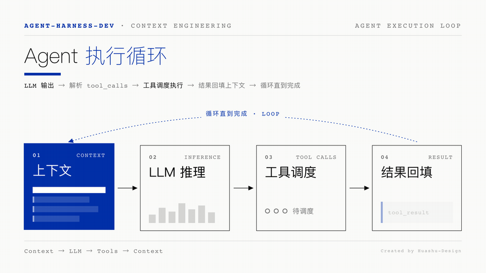
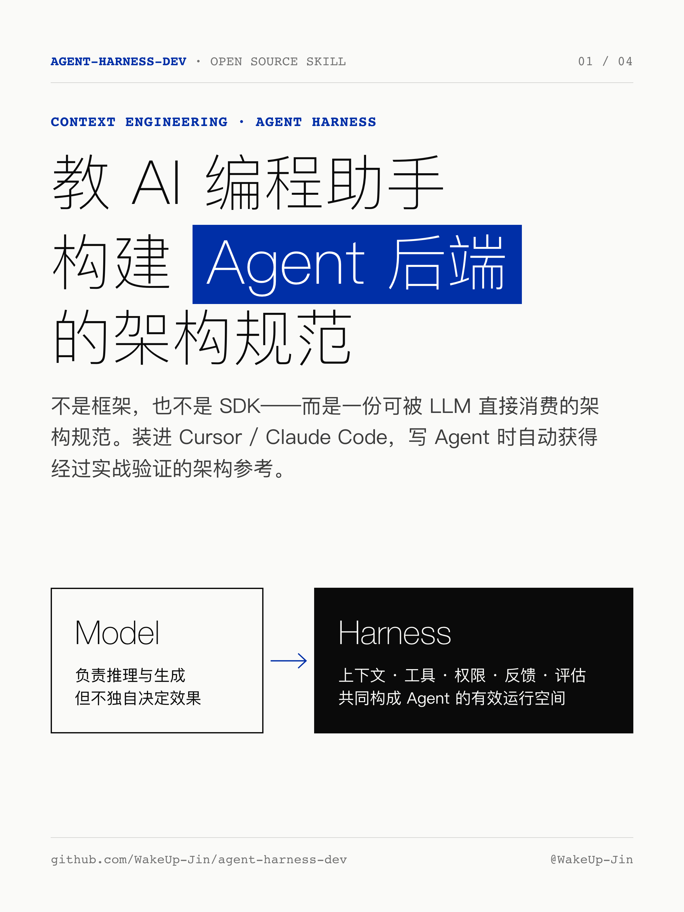
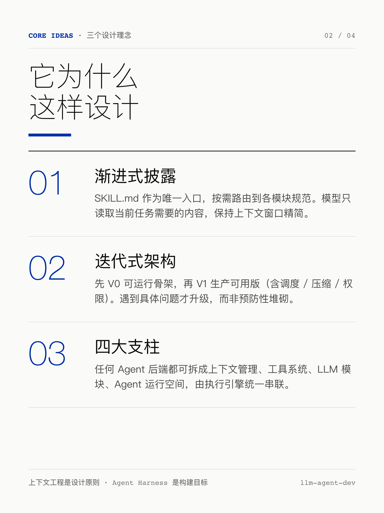
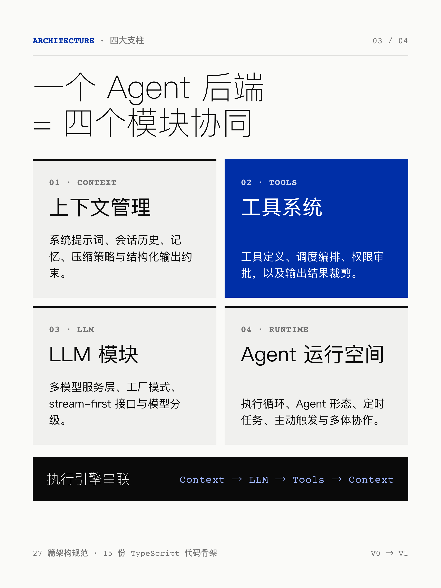
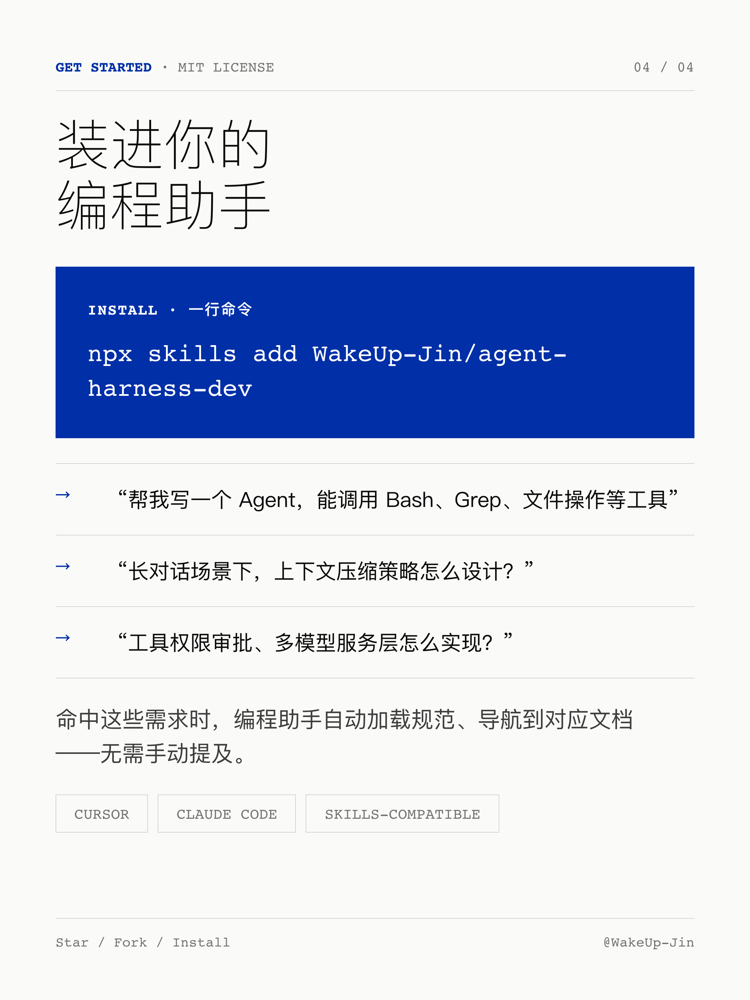
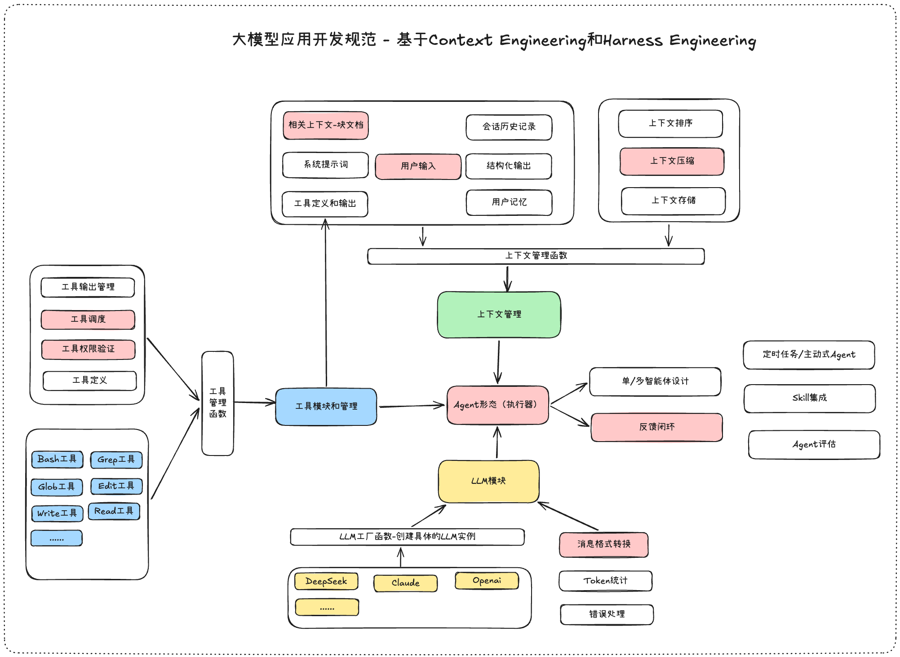

<div align="center">

# agent-harness-dev

**一份构建 Agent 后端的 Skill —— 从 Context Engineering 与 Harness Engineering 的设计理念整理而来**

[安装](#安装) · [核心理念](#核心理念) · [架构](#架构) · [模块一览](#模块一览)



</div>

---

## 是什么

`agent-harness-dev` 是一份**可被 LLM 直接消费的 [Skill](https://github.com/vercel-labs/skills)**——不是框架，也不是 SDK。

它把 **Context Engineering**（如何在有限窗口内选择、组织、注入最相关的信息）与 **Harness Engineering**（如何为 Agent 搭建稳定的运行空间）两套设计理念，整理成 AI 编程助手能直接执行的架构规范。装进 Cursor、Claude Code 后，它在帮你写 Agent 时自动提供经过实战验证的架构参考——从第一个 `runAgentLoop` 原型，到含调度、压缩、权限的生产级系统。

> 上下文工程（Context Engineering）是设计原则，Agent Harness 是构建目标。

## 理论参考

本 Skill 整理自 [《上下文工程与运行空间实践指南》](https://github.com/WakeUp-Jin/Practical-Guide-to-Context-Engineering)——从上下文工程到 Harness Engineering 的系统化方法论。指南讲「为什么这样设计」，本 Skill 负责「让 AI 编程助手照着这样构建」。

## 安装

```bash
npx skills add WakeUp-Jin/agent-harness-dev
```

<details>
<summary>更多安装方式</summary>

```bash
# 全局安装到 Cursor / Claude Code
npx skills add WakeUp-Jin/agent-harness-dev -a cursor -g -y
npx skills add WakeUp-Jin/agent-harness-dev -a claude-code -g -y

# 手动 clone
git clone https://github.com/WakeUp-Jin/agent-harness-dev.git ~/.cursor/skills/agent-harness-dev
```

| 参数 | 说明 |
| --- | --- |
| `-a, --agent <name>` | 目标 Agent：`cursor`、`claude-code` |
| `-g, --global` | 安装到用户全局目录 |
| `--copy` | 拷贝文件而非软链接（离线/容器场景） |
| `-y, --yes` | 跳过交互式确认 |

</details>

## 核心理念

- **渐进式披露** — `SKILL.md` 作为唯一入口，按需路由到各模块规范，模型只读取当前需要的内容。
- **迭代式架构** — 先 **V0**（可运行骨架）再 **V1**（含调度/压缩/权限的生产可用版），遇到问题才升级。
- **四大支柱** — 任何 Agent 后端都可拆成上下文管理、工具系统、LLM 模块、Agent 运行空间，由执行引擎串联。

## 工作原理

安装后 Skill **自动触发**——命中"写一个 Agent""工具调度""上下文管理""结构化输出"等需求时，编程助手会加载 `SKILL.md` 并导航到对应文档。信息按四层金字塔逐级展开：

```
SKILL.md           →  架构总览 + 模块路由（始终加载）
  └─ references/   →  各模块详细规范（按需加载）
      └─ examples/ →  TypeScript 代码骨架（按需加载）
```

## 一图速览

<table>
  <tr>
    <td width="50%"></td>
    <td width="50%"></td>
  </tr>
  <tr>
    <td width="50%"></td>
    <td width="50%"></td>
  </tr>
</table>

## 架构
<div align="centre">
</img>
</div>

四个模块通过执行引擎串联：LLM 输出 → 解析 `tool_calls` → 工具调度执行 → 结果回填上下文 → 循环直到完成（即顶部动图）。

## 模块一览

| 模块 | 覆盖内容 | 参考文档 |
| --- | --- | --- |
| **架构设计** | V0/V1 构建路径、目录结构、模块组装 | [`architecture.md`](skills/agent-harness-dev/references/architecture.md) |
| **上下文管理** | 上下文管道、压缩策略、记忆、结构化输出 | [`context/`](skills/agent-harness-dev/references/context) |
| **工具系统** | 工具定义、调度编排、权限审批、输出裁剪 | [`tools/`](skills/agent-harness-dev/references/tools) |
| **LLM 模块** | 多模型服务层、工厂模式、模型分级 | [`llm/`](skills/agent-harness-dev/references/llm) |
| **Agent 运行空间** | 执行循环、Agent 形态、定时任务、KAIROS | [`agent-runtime/`](skills/agent-harness-dev/references/agent-runtime) |
| **评估体系** | 评估框架、多类型评估策略、评分实现 | [`agent-evaluation/`](skills/agent-harness-dev/references/agent-evaluation) |
| **基础设施** | RAG 检索策略、Skill 集成 | [`foundations/`](skills/agent-harness-dev/references/foundations) |
| **工程实践** | 常见陷阱、上下文污染、Skill 构建经验 | [`practices/`](skills/agent-harness-dev/references/practices) |

## 仓库结构

```
.
├── README.md                  # 仓库说明（仅 GitHub 展示，不随 Skill 安装）
├── public/                    # README 配图与动图（同上，不安装）
└── skills/
    └── agent-harness-dev/     # Skill 本体——npx skills add 只安装这里
        ├── SKILL.md           # 入口：架构总览 + 模块路由
        ├── references/        # 各模块详细规范（按需加载）
        ├── examples/          # TypeScript 代码骨架
        └── assets/            # 规范中引用的架构图
```

> 把 README 展示资源放在仓库根目录、Skill 本体放在 `skills/` 子目录，安装时只会拉取 Skill 内容，不会把 `public/` 的图一起装进编程助手。

## 兼容性

适用于 [Cursor](https://cursor.com)、[Claude Code](https://docs.anthropic.com/en/docs/agents-and-tools/claude-code/overview)，以及任何兼容 [vercel-labs/skills](https://github.com/vercel-labs/skills) 规范的工具。

## 参与贡献

提交 PR 前请阅读 [CONVENTIONS.md](CONVENTIONS.md)。核心约束：目录最多两层、文档通过路径引用代码、单个 reference 控制在 100–200 行、用祈使句解释"为什么"而非堆砌规则。

## 参考与致谢

- [上下文工程与运行空间实践指南](https://github.com/WakeUp-Jin/Practical-Guide-to-Context-Engineering) — 从上下文工程到 Harness Engineering 的系统化方法论，本项目的理论参考。
- [Linux.Do 社区](https://linux.do/latest) (真诚 、友善 、团结 、专业)

## 许可证

MIT · 作者 [@WakeUp-Jin](https://github.com/WakeUp-Jin)
