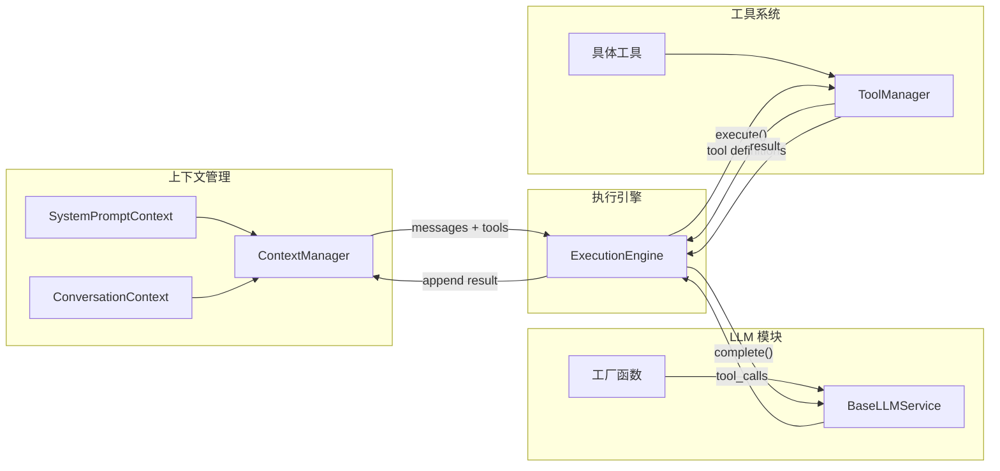

# Agent 架构设计

本文档是 references 的入口和组装指南。各模块文档解释"是什么"，本文档解释"如何把它们组装起来"。

Agent 是迭代出来的，不是一次设计出来的。本文档定义两个版本——V0（Demo）和 V1（基础）——提供渐进式构建路径。在开始之前，先确认两件事：

1. 使用的编程语言（本 Skill 示例默认 TypeScript，支持 Python/Go/Rust 等）
2. 构建版本：**V0 Demo 版**（完整骨架，快速理解 Agent 运行原理）还是 **V1 基础版**（生产可用，含调度/压缩/权限）

## 一、四大支柱

Agent 后端由四个相互协作的模块构成：

- **LLM 模块**：多模型接入的服务层，通过工厂模式创建实例，提供统一的 complete/chat 接口
- **上下文管理**：编排注入给 LLM 的完整输入（系统提示词、会话历史、记忆、结构化输出约束）
- **工具系统**：定义工具能力、管理调度流程、控制权限审批、裁剪输出结果
- **Agent 形态**：Agent 的执行形态（单体/多体/协同）与运行环境（交互式/定时任务/后台常驻）

四个模块通过**执行引擎**串联：



执行引擎的核心循环：LLM 输出 → 解析 tool_calls → 工具调度执行 → 结果回填上下文 → 循环直到 LLM 返回纯文本或达到最大迭代次数。

## 二、V0 Demo 版——完整骨架

### 目标

搭建完整的项目骨架，所有模块都存在但实现最简化。能跑起来、能对话、能调工具。

### 设计原则

- **骨架完整**：四个模块（llm/tool/context/engine）的目录结构和类型定义都在
- **实现极简**：每个模块只有最基础的实现，不引入任何"优化"类的代码
- **方便升级**：V1 是在 V0 的结构中"填充和替换"，不是推翻重来

### 目录结构

```
src/
  core/
    llm/
      types           # LLMConfig, LLMResponse, TokenUsage, ToolCall, ILLMService
      base            # BaseLLMService（含重试机制）
      openai_service  # OpenAIService（通过 OpenAI SDK 兼容 DeepSeek）
      factory         # create_llm_service() 工厂函数
    tool/
      types           # InternalTool, ToolResult（简化版）
      manager         # ToolManager（注册/查询/执行/格式化）
      tools/
        read_file     # ReadFile 工具定义 + executor
    context/
      types           # ContextItem（完整版）, PromptSegment, ContextParts, SystemPart, ItemUsage
      base            # BaseContext<T> 泛型基类
      manager         # ContextManager 编排器
      modules/
        system_prompt # SystemPromptContext（完整分段能力）
        conversation  # ConversationContext（极简会话历史）
    engine/
      engine          # ExecutionEngine（基础循环，直接调用 ToolManager）
  agent               # Agent 入口，组装所有模块
  prompts/
    system            # 默认系统提示词
  config              # 基础配置
```

### LLM 模块

| 包含 | 不包含 |
|------|--------|
| `LLMConfig` / `LLMResponse` / `TokenUsage` / `ToolCall` 类型定义 | Registry 模式 |
| `BaseLLMService` 基类（含重试机制） | 多 tier（high/medium/low） |
| `OpenAIService`（通过 OpenAI SDK 兼容 DeepSeek） | |
| `create_llm_service()` 工厂函数 | |

工厂函数接收 LLMConfig，根据 provider 字段映射到具体服务类。V0 只需要一个 OpenAIService，因为大多数国内模型（DeepSeek、Qwen 等）都兼容 OpenAI SDK 格式。

详见 `references/llm/llm-service.md`，参考代码 `examples/llm-factory.ts`、`examples/llm-service.ts`

### 工具模块

| 包含 | 不包含 |
|------|--------|
| `InternalTool` / `ToolResult` 类型定义（简化版） | ToolScheduler |
| `ToolManager`（注册、查询、执行、格式化为 OpenAI function calling） | ApprovalStore / OutputTruncator 类 |
| `ReadFile` 工具（最基础的文件读取） | PermissionResult / ToolCallRecord |
| 极简输出截断（ToolManager 层硬截断，约 10 行代码） | check_permissions / is_read_only |

V0 的 InternalTool 只需要核心字段：name、description、parameters（JSON Schema）、handler。不需要 check_permissions、is_read_only、render_result 等。

极简输出截断的目的：防止一次 ReadFile 大文件把上下文撑爆。在 ToolManager.execute() 内部，对结果字符串做硬截断（超过阈值则保留前半 + 后半 + 截断标记）。这不是 OutputTruncator——没有 LLM 摘要，只有字符截断。

详见 `references/tools/tool-definition.md`，参考代码 `examples/tool-definition.ts`

### 上下文模块

V0 的上下文模块要让使用者理解完整的数据流：

```
模块.format() -> ContextParts(system_parts, message_items)
                        |                       |
                        v                       v
              合并为一条 system message    通过 to_message() 转为 message dict
                        |                       |
                        +--------合并为----------+
                                  |
                                  v
                        最终的 messages 数组 -> LLM.complete()
```

#### 类型体系

| 类型 | 职责 |
|------|------|
| `ContextItem` | 内部数据结构，完整版：role/content/source/priority/tool_calls/tool_call_id/thinking/usage。提供 `to_message()` 转 LLM API 格式、`from_message()` 从 API 格式创建、`to_dict()`/`from_dict()` 持久化序列化 |
| `ItemUsage` | token 和成本记录（prompt_tokens/completion_tokens/cached_tokens/cost） |
| `PromptSegment` | 系统提示词分段（id + content + priority + enabled） |
| `SystemPart` | 一段 system 级内容，带 XML 标签包裹，通过 `render()` 输出 |
| `ContextParts` | 模块 `format()` 的返回类型，包含 `system_parts: SystemPart[]` 和 `message_items: ContextItem[]` |
| `MessagePriority` | 消息优先级枚举（LOW/NORMAL/HIGH/CRITICAL），压缩时决定保留顺序 |

#### BaseContext\<T\>

泛型抽象基类，提供标准的 CRUD 操作（add/get/get_all/clear/remove_last/replace/slice/count）和抽象方法 `format() -> ContextParts`。所有上下文模块继承此基类。

#### SystemPromptContext

继承 `BaseContext<PromptSegment>`，管理分段式系统提示词：

- `register_segment(segment)` / `update_segment(id, content)` / `remove_segment(id)`
- `enable_segment(id)` / `disable_segment(id)`
- `get_prompt()`：按优先级降序排列已启用的段落，拼接输出
- `format()`：返回 `ContextParts(system_parts=[SystemPart(tag="system_prompt", content=prompt)])`

初始化时自动注册一个 core 段落（优先级最高），内容为默认系统提示词。

详见 `references/context/type-system-prompt.md`，参考代码 `examples/system-prompt.ts`

#### ConversationContext

继承 `BaseContext<ContextItem>`，极简的会话历史管理：

- 通过 `add(item)` 追加 user/assistant/tool 消息
- `format()`：返回 `ContextParts(message_items=[...所有消息])`
- 不涉及持久化、不涉及 turn 标记、不涉及压缩

V1 时替换为 `ShortTermMemoryContext`（增加持久化、turn 标记、压缩集成）。

#### ContextManager

编排器，持有 SystemPromptContext + ConversationContext：

- `_collect_parts()`：依次调用各模块的 `format()`，收集所有 system_parts 和 message_items
- `get_context()`：将 system_parts 合并渲染为一条 system message，将 message_items 逐个通过 `to_message()` 转为 message dict，返回最终的 messages 数组
- `append_item(item)` / `append_message(dict)` / `clear_conversation()`：公开 API，供 Agent 和 Engine 调用

详见 `references/context/mgmt-context-architecture.md`，参考代码 `examples/context-manager.ts`

### 执行引擎

| 包含 | 不包含 |
|------|--------|
| `ExecutionEngine` 基础循环 | 与 ToolScheduler 的集成 |
| max_iterations 安全阀 | on_message 回调 |
| 直接调用 ToolManager.execute() | 事件发射 |

核心循环（伪代码）：

```
for i in range(max_iterations):
    response = llm.complete(messages, tools)

    if no tool_calls:
        return response.text

    append assistant message to context
    for each tool_call:
        result = tool_manager.execute(tool_call.name, tool_call.args)
        append tool result to context

if reached max_iterations:
    force final response without tools
```

详见 `references/agent-runtime/agent-patterns.md`，参考代码 `examples/agent-loop.ts`

### Agent 入口

组装所有模块，暴露 `run(user_input) -> response` 方法：

1. 将 user_input 包装为 ContextItem，追加到 ConversationContext
2. 通过 ContextManager.get_context() 获取完整 messages
3. 通过 ToolManager.get_formatted_tools() 获取工具定义
4. 调用 ExecutionEngine.run(llm, messages, tools) 执行循环
5. 将 assistant 回复追加到 ConversationContext
6. 返回结果文本

## 三、V1 基础版——生产可用骨架

从 V0 升级为可以应对真实业务场景的基础版本。每一项增强都有**触发信号**——回答"什么时候你需要这个"，而非"你应该要这个"。

### V0 → V1 升级清单

#### 1. 工具调度器 + 输出裁剪（优先级最高）

**触发信号**：Agent 需要调用 Bash 或文件写入工具，你意识到需要权限控制和输出管理。

升级内容：
- 新增 `ToolScheduler`，实现完整的工具调用生命周期：validating → awaiting_approval → scheduled → executing → render_result → truncation → success/error/cancelled
- 新增 `OutputTruncator`（两层裁剪：第一层硬截断防止撑爆 LLM 摘要、第二层保留前 N 字符 + LLM 摘要）
- 新增 `ApprovalStore`（通过 asyncio.Future / Promise 实现跨协程/异步的审批等待）
- `InternalTool` 类型扩展：增加 `check_permissions`（权限验证函数）、`is_read_only`（影响审批判断和并行调度）、`render_result`（自定义输出格式化）
- 新增类型：`PermissionResult`、`ToolCallRecord`、`ScheduleResult`、`ApprovalMode`、`ConfirmDetails`
- ExecutionEngine 改为通过 ToolScheduler.schedule_batch() 调度，不再直接调用 ToolManager

详见 `references/tools/tool-scheduling.md`

#### 2. 更多基础工具

**触发信号**：ReadFile 不够用了，需要搜索和修改文件的能力。

升级内容：
- 新增工具：Bash、Grep、Glob、ListFiles、Edit、Write
- 每个工具遵循 definition + executor 分离模式，独立文件夹
- 每个工具定义 check_permissions（如 ReadFile 校验路径并展开为绝对路径、Bash 检查危险命令）

详见 `references/tools/bash-tool.md`、`references/tools/search-tools.md`、`references/tools/file-tools.md`

#### 3. 上下文升级：ShortTermMemoryContext

**触发信号**：需要会话历史持久化（进程重启不丢失）、需要 turn 标记区分对话轮次。

升级内容：
- V0 的 `ConversationContext` 替换为 `ShortTermMemoryContext`
- 增加：会话历史持久化（JSONL 文件 / Redis）
- 增加：turn 标记（mark_turn_start），压缩时按 turn 边界切分
- 增加：与压缩模块的集成（needs_compression / compress）
- 新增 `LongTermMemoryContext`（用户画像/偏好记忆，作为 SystemPart 注入 system message）

详见 `references/context/type-session-history.md`

#### 4. 上下文压缩

**触发信号**：长对话中 token 用量接近窗口上限。

升级内容：
- 新增 `CompressionConfig`（context_window、compression_threshold、compress_keep_ratio）
- ContextManager 增加 `needs_compression()` 和 `compress(summarize_fn)` 方法
- Agent.run() 中每轮结束后检查是否需要压缩
- 压缩使用 low tier 模型（见下一项）

详见 `references/context/mgmt-compression.md` + `references/context/mgmt-token-strategies.md`

#### 5. LLM Registry + 多 tier

**触发信号**：需要用便宜模型做摘要/压缩，用贵模型做主推理。

升级内容：
- 新增 `LLMServiceRegistry`（管理 high/medium/low 三级模型实例）
- 主推理使用 `registry.get_high()`
- 压缩和输出裁剪使用 `registry.get_low()`

详见 `references/llm/llm-service.md`

#### 6. Token 追踪

**触发信号**：需要监控成本、需要为压缩触发提供 token 数据。

升级内容：
- 新增 `TokenCounter`（累计 prompt/completion tokens，计算成本）
- 新增 `TokenEstimator`（估算当前上下文 token 数，为压缩触发提供依据）
- 新增消息清洗工具 `message_sanitizer`（确保 messages 数组符合 API 格式约束）

### V1 目录结构（V0 基础上扩展）

```
src/
  core/
    llm/
      types
      base
      openai_service
      factory
      registry              # [V1 新增] LLMServiceRegistry
    tool/
      types                 # [V1 扩展] 增加 PermissionResult, ToolCallRecord 等
      manager
      scheduler             # [V1 新增] ToolScheduler
      approval              # [V1 新增] ApprovalStore
      output_truncator      # [V1 新增] OutputTruncator
      tools/
        read_file/          # [V1 升级] definition + executor 分离
          definition
          executor
        bash/               # [V1 新增]
        grep/               # [V1 新增]
        glob/               # [V1 新增]
        edit/               # [V1 新增]
        write/              # [V1 新增]
    context/
      types                 # 沿用 V0（已完整）
      base                  # 沿用 V0
      manager               # [V1 升级] 增加压缩触发、Skill catalog 注入
      modules/
        system_prompt       # 沿用 V0
        conversation        # [V1 替换] -> short_term_memory
        short_term_memory   # [V1 新增] 替换 ConversationContext
        long_term_memory    # [V1 新增] 用户记忆模块
      utils/
        compressor          # [V1 新增] 压缩器
        token_estimator     # [V1 新增]
        message_sanitizer   # [V1 新增]
    engine/
      engine                # [V1 升级] 集成 ToolScheduler
  agent                     # [V1 升级] 增加压缩触发、Token 追踪
  prompts/
    system
    compression             # [V1 新增] 压缩提示词
  config
  utils/
    token_counter           # [V1 新增]
    logger                  # [V1 新增]
```

## 四、进阶扩展（V2+）

当 V1 运行稳定、业务需求升级时，按需选择。没有固定顺序，完全由业务需求驱动。

| 需求 | 参考文档 |
|------|----------|
| 多智能体系统（Supervisor/Swarm/层级化） | `references/agent-runtime/agent-patterns.md` |
| Skill 集成和渐进式加载 | `references/foundations/skill-integration.md` |
| RAG 外部知识检索 | `references/foundations/rag-strategy.md` |
| 结构化输出约束 | `references/context/type-structured-output.md` |
| 定时任务和 KAIROS 后台模式 | `references/agent-runtime/agent-runtime.md` |
| 评估体系 | `references/agent-evaluation/overview.md` |
| 上下文失控管理策略 | `references/context/mgmt-strategies.md` |

## 五、迭代实践指南

以下原则提炼自 `references/practices/`，指导从 V0 到 V1 再到 V2+ 的迭代。

### 何时升级

遇到具体问题时才引入对应模块：

- 工具输出太长导致上下文被低价值信息占满 → 引入 OutputTruncator
- 需要 Bash/Edit 等危险操作但没有权限控制 → 引入 ToolScheduler + ApprovalStore
- 长对话 token 接近上限 → 引入压缩机制
- 需要用便宜模型做辅助任务 → 引入 LLM Registry 多 tier

### 何时删减

模型能力升级后，某些约束变成阻碍：

- 过于细致的任务拆分在强模型下不再必要
- 某些格式约束可能限制了模型的发挥
- Harness 是动态的，随模型升级而调整

详见 `references/practices/agent-engineering.md`

### 反馈回路

- Agent 输出经独立审查 Agent 验证，审查不通过则回注修改
- 评估与执行分离：不在同一个 Agent 中既执行任务又评估结果
- Agent 间通信使用文件：简单、可审计、无需复杂的进程间通信
- 将主观判断变为客观标准（设计质量、原创性、工艺、功能性）

### Skill 作为能力扩展机制

Skill 不是堆代码，而是通过文件夹 + 渐进式加载扩展 Agent 能力：

- Skill 的核心价值是"增量知识"——模型不知道的、容易出错的、项目特有的信息
- 可执行脚本是 Skill 的杀手锏
- description 触发准确性比内容质量更重要

详见 `references/practices/building-skills.md`

## 六、快速参考表

### V0 涉及的模块

| 我想做什么 | 去读 | 示例代码 |
|-----------|------|----------|
| 设计 LLM 服务层、工厂模式 | `references/llm/llm-service.md` | `examples/llm-factory.ts`、`examples/llm-service.ts` |
| 定义工具、设计参数 schema | `references/tools/tool-definition.md` | `examples/tool-definition.ts` |
| 设计上下文数据结构和管道 | `references/context/mgmt-context-architecture.md` | `examples/context-manager.ts` |
| 设计系统提示词分段 | `references/context/type-system-prompt.md` | `examples/system-prompt.ts` |
| 实现执行循环 | `references/agent-runtime/agent-patterns.md` | `examples/agent-loop.ts` |

### V1 新增的模块

| 我想做什么 | 去读 | 示例代码 |
|-----------|------|----------|
| 实现工具调度生命周期、权限审批 | `references/tools/tool-scheduling.md` | `examples/tool-scheduler.ts` |
| 开发 Bash 工具 | `references/tools/bash-tool.md` | `examples/bash-tool.ts` |
| 开发 Grep/Glob 搜索工具 | `references/tools/search-tools.md` | `examples/grep-tool.ts` |
| 开发文件读写工具 | `references/tools/file-tools.md` | — |
| 设计会话历史存储 | `references/context/type-session-history.md` | `examples/session-storage.ts` |
| 设计上下文压缩策略 | `references/context/mgmt-compression.md` | `examples/context-compressor.ts` |
| 设计 Token 压缩执行策略 | `references/context/mgmt-token-strategies.md` | — |

### V2+ 扩展模块

| 我想做什么 | 去读 | 示例代码 |
|-----------|------|----------|
| 设计多智能体系统 | `references/agent-runtime/agent-patterns.md` | — |
| 设计定时任务和 KAIROS 模式 | `references/agent-runtime/agent-runtime.md` | — |
| 集成 Skill 系统 | `references/foundations/skill-integration.md` | — |
| 集成 RAG | `references/foundations/rag-strategy.md` | — |
| 约束 LLM 输出格式 | `references/context/type-structured-output.md` | `examples/structured-output.ts` |
| 搭建评估体系 | `references/agent-evaluation/overview.md` | `examples/evaluation-system.ts` |
| 处理上下文失控问题 | `references/context/mgmt-strategies.md` | — |
| 工程实践与常见陷阱 | `references/practices/agent-engineering.md` | — |
| 设计和构建 Skill | `references/practices/building-skills.md` | — |
