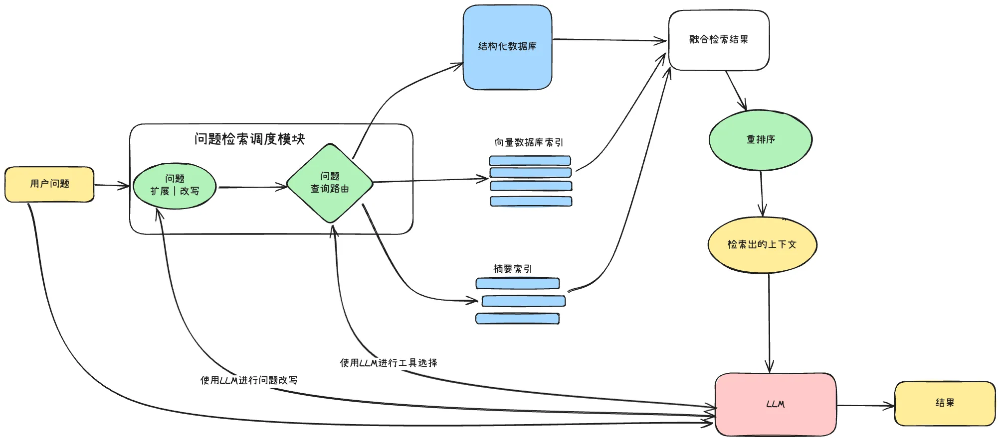
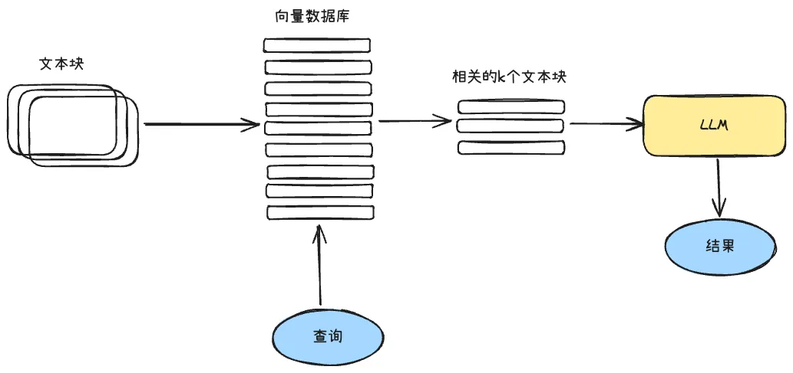
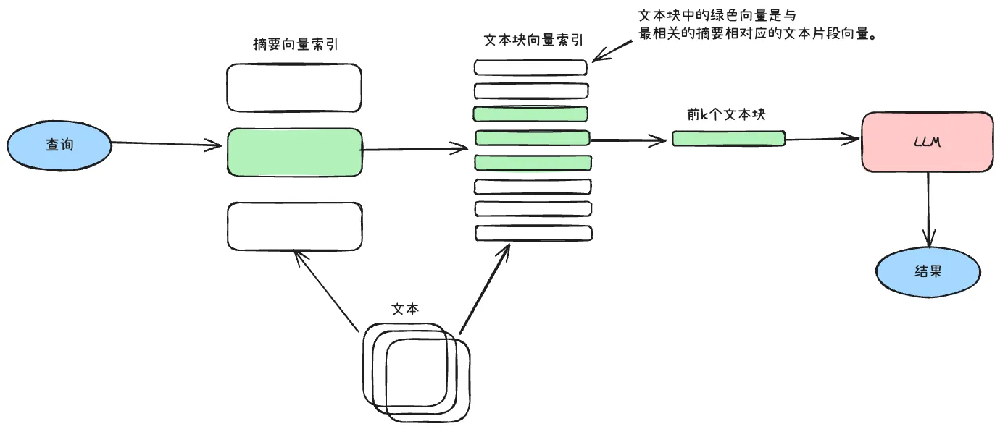
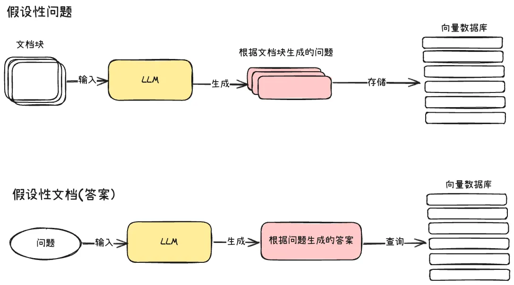
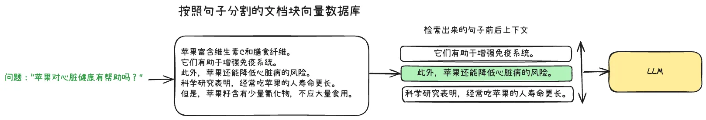
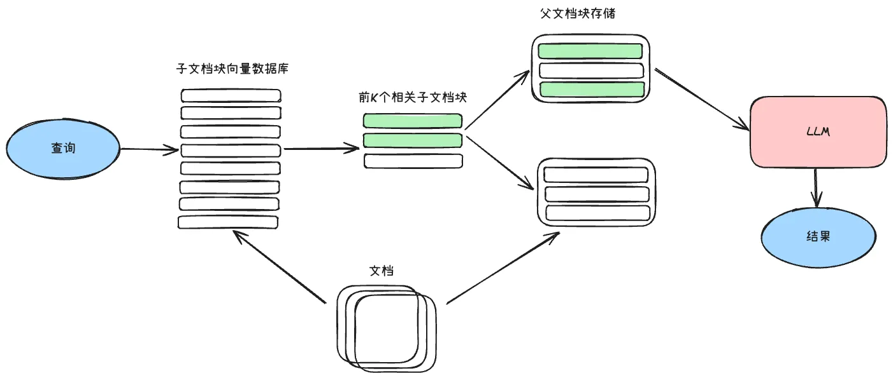
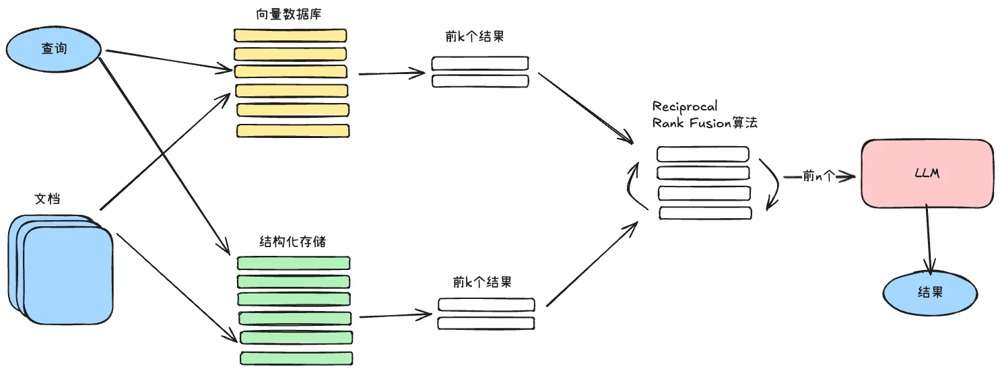
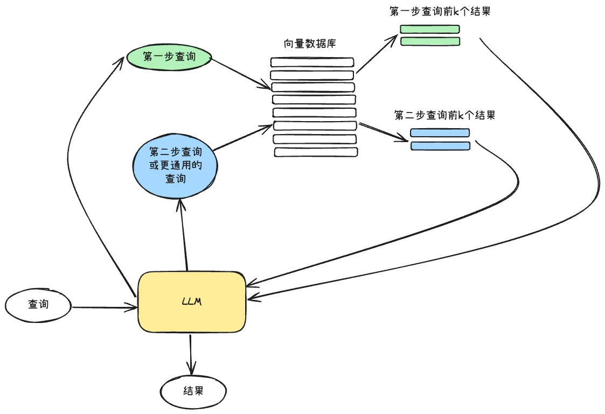
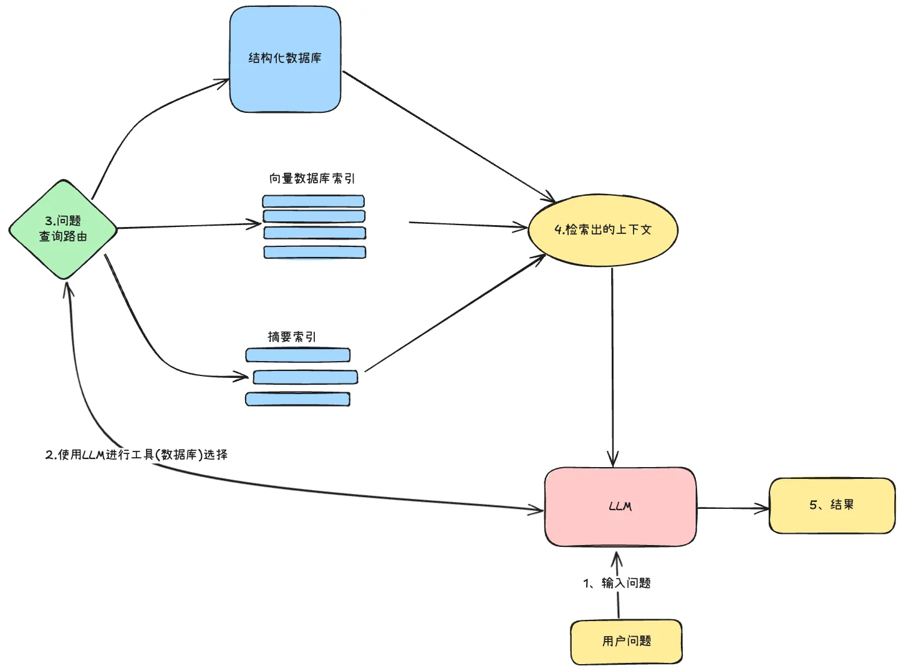

# RAG 策略

RAG（检索增强生成）是上下文工程中的一个子集——它负责为 LLM 动态注入与当前任务相关的外部知识。RAG 不是独立的功能模块，而是上下文管理的一种信息来源方式：在用户输入到达时，从外部知识库中找到最相关的信息补充进上下文。

无论上下文窗口多大，RAG 都有价值——它解决的是"相关性筛选"问题而非"容量"问题。

## 分块与向量化

### 分块

分块大小是首要参数，受两个约束：嵌入模型的最大 token 长度（不同模型差异大，如 bge-m3 支持 8K，Qwen3-Embedding 支持 32K），以及语义完整性的需求。

核心权衡：块要足够长，让 LLM 推理时有充分上下文；又要足够短，让生成的向量能准确表达语义，提高检索精度。

分块策略建议：
- 按语义边界分块（段落、函数、章节），而非固定字符数
- 块之间保留重叠部分（overlap），避免关键信息被切断在边界

### 向量化

文本块经嵌入模型转为固定维度的数字数组（向量），存入向量数据库。选择嵌入模型时考虑两点：

- **向量维度**：维度过低导致语义丢失，过高增加存储和计算成本
- **语言支持**：中文场景使用专门针对中文优化的嵌入模型

## 搜索索引

### 向量存储索引

最基础的方式。查询时将文本用嵌入模型转为向量，在向量数据库中检索前 K 个最相似的向量，再通过向量 ID 映射回原始文本块。

索引实现方式影响检索速度：
- **平面索引**：暴力计算查询向量与所有向量的距离，精确但慢
- **近似最近邻（ANN）**：通过聚类倒排（IVF）、树结构（Annoy）或图结构（HNSW）加速搜索，牺牲少量精度换取大幅提速

存储向量时同时保存元数据——元数据可以作为过滤条件限定检索范围（如按日期、来源筛选），也可以作为附加信息丰富检索结果。

### 分层索引

核心思路：先粗筛再细筛。创建两层索引——文档摘要索引和文本块索引，两层之间有关联关系。检索时先通过摘要索引过滤出相关文档，再只在这些文档内部进行片段级检索。适合文档量大、主题分散的知识库。

### 假设性问题与 HyDE

两种利用 LLM 改善检索匹配度的方法：

**假设性问题**（源头是文档）：对每个文档块，让 LLM 生成几个用户可能会问的问题，将这些问题向量化建索引。检索时用户问题匹配的是"文档问题"，再回溯到原始文档块。解决了用户措辞与文档措辞不匹配的问题。

**HyDE**（源头是查询）：用户输入问题后，先让 LLM 生成一段假设性答案，用这个"答案"去检索文档向量库。假设答案在语义空间中比原始问题更接近目标文档。

## 上下文增强

检索时用小片段提高精度，但提供给 LLM 前补充周围上下文，确保 LLM 有充足信息进行推理。

### 句子扩展

检索到小片段后，将其前后相邻的片段拼接在一起，组成更完整的上下文块输入给 LLM。效果是从单一观点扩展为包含背景和结论的完整论述。

### 父文档检索

将文档分为两层——大的父级片段包含小的子级片段。检索时使用子片段的向量库（小片段更精准），命中后回溯到父级片段，将更完整的上下文输入 LLM。子片段只承担检索中介角色。

## 融合检索

结合两种检索方式的优点：基于关键词的传统搜索（精确匹配强）和基于向量的语义搜索（理解意图强）。

难点在于如何融合两种评分标准不同的结果。通常使用 Reciprocal Rank Fusion（RRF）算法对检索结果重新排序，生成统一的最终输出。

## 重排序与过滤

检索结果需要进一步优化：

- 按相似度分数排序，取前 K 个
- 利用元信息（时间、用户 ID、来源）过滤不相关结果
- 使用重排序模型（cross-encoder）对粗检索结果精排——先宽泛检索 Top-N，再精排取 Top-K
- 也可以直接让 LLM 对检索文本进行排序（成本更高但效果好）

## 查询转换

用 LLM 作为推理引擎修改用户输入，提升检索质量。三种方式：

- **子查询分解**：复杂问题拆为多个简单子查询并行检索，合并结果。例如"Langchain 和 LlamaIndex 哪个星标更多"拆为两个独立查询
- **Step-back Prompting**：让 LLM 先生成更通用的查询，检索高层次上下文为原始查询提供语义基础，两类结果合并输入 LLM
- **查询重写**：让 LLM 改写原始查询，使其更适合检索（消除歧义、补充关键词）

## 引用来源

让 LLM 在答案中标注信息来源，提供"信息审核"机制，增强答案可信度。两种实现方式：

- 在提示词中要求 LLM 引用所使用来源的 ID
- 将 LLM 生成的响应与检索出的原始文本块进行匹配

## 查询路由

由 LLM 驱动的决策步骤：根据用户查询决定使用哪种检索策略。可选的路由目标包括摘要索引、文本块索引、结构化数据库等，最终综合各路径的输出。

查询路由的关键是定义路由器的选择范围——能提供哪些检索策略和数据源。

## 在 Agent 中的特殊应用

- **工具定义检索**：工具数量超过 30 个时，将工具描述存入向量库，根据用户输入检索最相关的工具子集注入上下文
- **记忆检索**：长期记忆模块使用语义搜索检索相关历史记忆，而非全量加载
- **文档检索**：Skill 系统的渐进式披露也是一种 RAG 思想——按需加载相关文档片段

## 注意事项

- 索引阶段的分块质量比检索算法更重要——"Garbage in, garbage out"
- Top-K 数量需要权衡：太多增加上下文噪音，太少可能遗漏关键信息
- RAG 不是万能的——对于需要全局理解的任务（如代码重构），片段化检索结果可能不如直接加载完整文件
- 多种检索策略可以组合使用，根据具体场景选择最合适的组合
