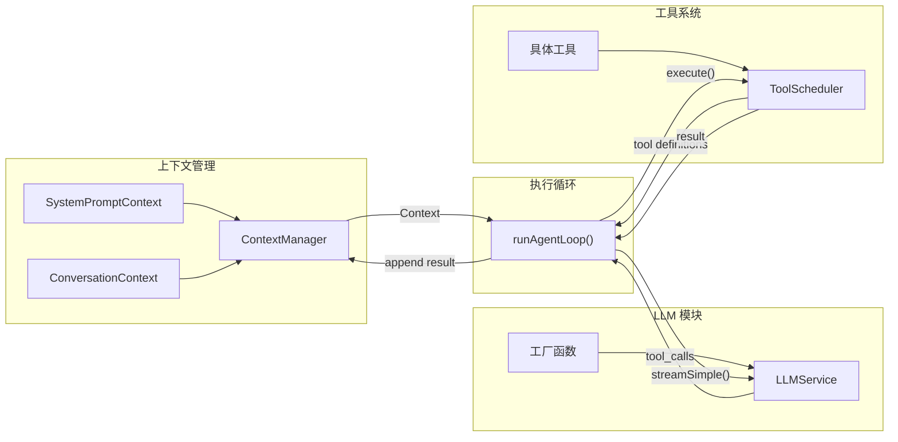

# Agent 架构设计

本文档是 references 的入口和组装指南。各模块文档解释"是什么"，本文档解释"如何把它们组装起来"。

Agent 是迭代出来的，不是一次设计出来的。本文档定义两个版本——V0（Demo）和 V1（基础）——提供渐进式构建路径。在开始之前，先确认两件事：

1. 使用的编程语言（本 Skill 示例默认 TypeScript，支持 Python/Go/Rust 等）
2. 构建版本：**V0 Demo 版**（完整骨架，快速理解 Agent 运行原理）还是 **V1 基础版**（生产可用，含调度/压缩/权限）

## 目录

- [一、四大支柱](#一四大支柱)
- [二、V0 Demo 版——完整骨架](#二v0-demo-版完整骨架)
- [三、V1 基础版——生产可用骨架](#三v1-基础版生产可用骨架)
- [四、进阶扩展（V2+）](#四进阶扩展v2)
- [五、迭代实践指南](#五迭代实践指南)
- [六、快速参考表](#六快速参考表)

## 一、四大支柱

Agent 后端由四个相互协作的模块构成：

- **LLM 模块**：多模型接入的服务层，通过工厂模式创建实例，提供 stream-first 接口
- **上下文管理**：编排注入给 LLM 的完整输入（系统提示词、会话历史、记忆、结构化输出约束）
- **工具系统**：定义工具能力、管理调度流程、控制权限审批、裁剪输出结果
- **Agent 形态**：Agent 的执行形态（单体/多体/协同）与运行环境（交互式/定时任务/后台常驻）

四个模块通过**执行循环**（agent loop）串联：



执行循环采用纯函数设计（`runAgentLoop`），通过双层 while 循环实现完整编排：LLM 流式输出 → 解析 tool_calls → 工具调度执行 → 结果回填上下文 → 循环直到 LLM 不再产生工具调用。通过事件回调（emit）通知外部所有生命周期事件。

## 二、V0 Demo 版——完整骨架

### 目标与原则

搭建完整的项目骨架，所有模块都存在但实现最简化——能跑起来、能对话、能调工具。V1 是在 V0 的结构中"填充和替换"，不是推翻重来。

### 目录结构

```
src/
  core/
    llm/
      types           # LLMConfig, Context, Message, Usage, Content Types 等
      convert         # 共享消息转换 + 防御性处理 + 错误映射
      base            # BaseLLMService（可选——仅跨 API 协议时需要，
                      #   只用 OpenAI 兼容 provider 时用 LLMService interface 替代）
      factory         # create_llm_service() 工厂函数
      services/       # 具体 provider 实现
        openai        # OpenAICompatibleService（OpenAI SDK，覆盖 DeepSeek/Kimi/Qwen 等）
        mock          # MockLLMService（response queue，开发测试必备）
    tool/
      types           # InternalTool, ToolResult, PermissionResult
      manager         # ToolManager（注册/查询/执行/格式化）
      tools/
        read-file/
          definition  # name, description, parameters, isReadOnly, category
          executor    # handler 函数实现
    context/
      types           # Context, Message, SystemPart, ContextParts
      base            # BaseContext<T> 泛型基类
      manager         # ContextManager 编排器
      modules/
        system_prompt # SystemPromptContext（分段式系统提示词）
        conversation  # ConversationContext（极简会话历史）
    engine/
      agent-loop      # runAgentLoop（函数式双层循环）
  agent               # Agent 入口，组装所有模块
  prompts/
    system            # 默认系统提示词
  config              # 基础配置
```

目录组织的三个约定（与各模块参考文档一致）：

- **llm/services/ 子目录**：基础设施（types/convert/factory）和具体 provider 实现分离，新增 provider 只在 `services/` 下加文件
- **每个工具一个文件夹**（definition + executor 各一个文件）：与「definition + executor 分离」理念一致——definition 可被 LLM tool list 消费而不加载 executor，executor 可独立单元测试
- **context/modules/ 子目录**：编排器（manager）和被编排的模块分离

### LLM 模块

V0 默认走最简路径：`LLMService` interface + OpenAI SDK 直接实现。一个 OpenAICompatibleService 就能覆盖大多数模型（DeepSeek、Kimi、Qwen 等都兼容 OpenAI API 格式），不需要为每个供应商建类，也不需要手写 SSE 解析。

`base`（BaseLLMService 抽象基类）是**可选项**——仅当需要同时支持多种 API 格式（OpenAI + Anthropic + Google）时才引入。详细的选型路径见 `references/llm/llm-service.md` 的「按规模分层路径指引」。

详见 `references/llm/llm-service.md`，参考代码 `examples/llm-factory.ts`、`examples/llm-service.ts`、`examples/llm-openai-sdk-service.ts`

### 工具模块

V0 的工具只需核心字段：name、description、parameters（JSON Schema）、handler。权限控制和输出裁剪留给 V1。

唯一需要注意的是极简输出截断——在 ToolManager.execute() 内部对结果做硬截断，防止一次 ReadFile 大文件把上下文撑爆。

详见 `references/tools/tool-definition.md`，参考代码 `examples/tool-definition.ts`

### 上下文模块

上下文数据流：

```
模块.format() -> ContextParts(systemParts, messages)
                        |                    |
                        v                    v
              渲染为 Context.systemPrompt   合并为 Context.messages
                        |                    |
                        +------组装为--------+
                                  |
                                  v
                    Context { systemPrompt, messages, tools } -> LLM.streamSimple()
```

ContextManager 直接持有 Context 对象，`appendMessage()` 操作 messages，`getContext()` 刷新 systemPrompt 后返回引用。类型体系的核心设计是 Message 判别联合——每种角色（user/assistant/toolResult）只有自己需要的字段。

详见 `references/context/mgmt-context-architecture.md`，参考代码 `examples/context-manager.ts`

### 执行循环

核心循环采用纯函数 `runAgentLoop` 实现，双层 while 结构（伪代码）：

```
runAgentLoop(context, llm, config, emit, signal):
  外层 while(true):                    # follow-up 层
    内层 while(hasToolCalls || pending):  # tool calls + steering 层
      streamAssistantResponse(context, llm)
      if has tool_calls:
        executeToolCalls(scheduler, toolCalls)
        append results to context
      check shouldStopAfterTurn
      poll steering messages
    check follow-up messages
  emit agent_end
```

无 maxIterations 硬限制——循环到 agent 自己停止。安全阀通过 `shouldStopAfterTurn` 回调实现。通过事件系统（AgentEvent）通知外部所有生命周期事件，支持 AbortSignal 中途取消。

详见 `references/agent-runtime/agent-patterns.md`，参考代码 `examples/agent-loop.ts`

### Agent 入口

极简入口类，只做三件事：组装模块引用、提供 `run(userText)` 方法、提供 `abort()` 取消。run 流程：构造 UserMessage → ContextManager.appendMessage() → getContext() 获取 Context → 附加 tools → runAgentLoop 循环 → 返回最终回复。

## 三、V1 基础版——生产可用骨架

从 V0 升级为可以应对真实业务场景的基础版本。每一项增强都有**触发信号**——遇到具体问题时才引入，而非预防性堆砌。

### V1 目录结构（相对 V0 的 diff）

V1 在 V0 的结构中"填充和替换"，新增模块的落位如下（`+` 为新增，`*` 为替换/增强）：

```
src/
  core/
    llm/
      registry        # + LLMServiceRegistry（high/medium/low 多 tier）
    tool/
      scheduler       # + ToolScheduler（生命周期管理 + 权限审批 + 并行调度）
      output-truncator # + OutputTruncator（两条裁剪路径：摘要类 / 确定性头部+文件指针）
      approval-store  # + ApprovalStore（异步审批等待）
      shared/
        run-process   # + 通用受控子进程 runner（含流式落盘 sink）
        rg-runner     # + rg 命令适配层
        write-atomic  # + 原子写入
        file-read-tracker # + TOCTOU 防护
      tools/
        read-file/    #   （V0 已有）
        bash/         # + definition + executor + permissions（流式落盘）
        grep/         # + 复用 run-process + rg-runner
        glob/         # + 复用 run-process + rg-runner
        edit-file/    # + definition + executor + permissions（diff + 弯引号规范化）
        write-file/   # + definition + executor + permissions（diff）
        list-files/   # +
    context/
      token-estimator # + Token 估算
      compressor      # + 上下文压缩
      modules/
        conversation  # - 移除（被 short-term-memory 替换）
        short-term-memory # * 替换 ConversationContext（持久化 + turn 标记 + 压缩集成）
        long-term-memory  # + 用户画像/偏好
    storage/
      session         # + 会话历史持久化（JSONL）
```

### V0 → V1 升级清单

#### 1. 工具调度器 + 输出裁剪

**触发信号**：Agent 需要调用 Bash 或文件写入工具，你意识到需要权限控制和输出管理。

新增 ToolScheduler（工具调用生命周期管理）、OutputTruncator（两层裁剪）、ApprovalStore（异步审批等待）。执行循环通过 ToolScheduler 调度工具，支持 parallel/sequential 两种执行模式。

详见 `references/tools/tool-scheduling.md`

#### 2. 更多基础工具

**触发信号**：ReadFile 不够用了，需要搜索和修改文件的能力。

新增 Bash、Grep、Glob、ListFiles、Edit、Write，每个工具遵循 definition + executor 分离模式。

详见 `references/tools/bash-tool.md`、`references/tools/search-tools.md`、`references/tools/file-tools.md`

#### 3. 上下文升级：ShortTermMemoryContext

**触发信号**：需要会话历史持久化（进程重启不丢失）、需要 turn 标记区分对话轮次。

用 ShortTermMemoryContext 替换 V0 的 ConversationContext，增加持久化、turn 标记、压缩集成。新增 LongTermMemoryContext（用户画像/偏好）。

详见 `references/context/type-session-history.md`

#### 4. 上下文压缩

**触发信号**：长对话中 token 用量接近窗口上限。

ContextManager 增加 `needs_compression()` 和 `compress()` 方法，Agent.run() 每轮结束后检查。压缩使用 low tier 模型。

详见 `references/context/mgmt-compression.md` + `references/context/mgmt-token-strategies.md`

#### 5. LLM Registry + 多 tier

**触发信号**：需要用便宜模型做摘要/压缩，用贵模型做主推理。

新增 LLMServiceRegistry，管理 high/medium/low 三级模型实例。

详见 `references/llm/llm-service.md`

#### 6. Token 追踪

**触发信号**：需要监控成本、需要为压缩触发提供 token 数据。

新增 TokenCounter、TokenEstimator、message_sanitizer。

## 四、进阶扩展（V2+）

当 V1 运行稳定、业务需求升级时，按需选择。没有固定顺序，完全由业务需求驱动。

| 需求 | 参考文档 |
|------|----------|
| 多智能体系统（Supervisor/Swarm/层级化） | `references/agent-runtime/agent-patterns.md` |
| Skill 集成和渐进式加载 | `references/foundations/skill-integration.md` |
| RAG 外部知识检索 | `references/foundations/rag-strategy.md` |
| 结构化输出约束 | `references/context/type-structured-output.md` |
| 定时任务和 KAIROS 后台模式 | `references/agent-runtime/agent-runtime.md` |
| 评估体系 | `references/agent-evaluation/overview.md` |
| 上下文失控管理策略 | `references/context/mgmt-strategies.md` |

## 五、迭代实践指南

以下原则提炼自 `references/practices/`，指导从 V0 到 V1 再到 V2+ 的迭代。

### 何时升级

遇到具体问题时才引入对应模块——工具输出太长 → OutputTruncator，需要权限控制 → ToolScheduler，token 接近上限 → 压缩机制，需要便宜模型做辅助 → LLM Registry。

### 何时删减

模型能力升级后，某些约束变成阻碍。过于细致的任务拆分在强模型下不再必要，某些格式约束可能限制模型发挥。Harness 是动态的，随模型升级而调整。

详见 `references/practices/agent-engineering.md`

### 反馈回路

- Agent 输出经独立审查 Agent 验证，审查不通过则回注修改
- 评估与执行分离：不在同一个 Agent 中既执行任务又评估结果
- Agent 间通信使用文件：简单、可审计、无需复杂的进程间通信

### Skill 作为能力扩展机制

Skill 的核心价值是"增量知识"——模型不知道的、容易出错的、项目特有的信息。description 触发准确性比内容质量更重要。

详见 `references/practices/building-skills.md`

## 六、快速参考表

### V0 涉及的模块

| 我想做什么 | 去读 | 示例代码 |
|-----------|------|----------|
| 设计 LLM 服务层、工厂模式 | `references/llm/llm-service.md` | `examples/llm-factory.ts`、`examples/llm-service.ts`、`examples/llm-openai-sdk-service.ts`、`examples/llm-functional-api.ts` |
| 定义工具、设计参数 schema | `references/tools/tool-definition.md` | `examples/tool-definition.ts` |
| 设计上下文数据结构和管道 | `references/context/mgmt-context-architecture.md` | `examples/context-manager.ts` |
| 设计系统提示词分段 | `references/context/type-system-prompt.md` | `examples/system-prompt.ts` |
| 实现执行循环 | `references/agent-runtime/agent-patterns.md` | `examples/agent-loop.ts` |

### V1 新增的模块

| 我想做什么 | 去读 | 示例代码 |
|-----------|------|----------|
| 实现工具调度生命周期、权限审批 | `references/tools/tool-scheduling.md` | `examples/tool-scheduler.ts` |
| 开发 Bash 工具 | `references/tools/bash-tool.md` | `examples/bash-tool.ts`、`examples/run-process.ts` |
| 开发 Grep/Glob 搜索工具 | `references/tools/search-tools.md` | `examples/grep-tool.ts`、`examples/glob-tool.ts`、`examples/rg-runner.ts` |
| 开发文件读写工具 | `references/tools/file-tools.md` | `examples/edit-tool.ts`、`examples/write-tool.ts`、`examples/file-write-atomic.ts` |
| 设计会话历史存储 | `references/context/type-session-history.md` | `examples/session-storage.ts` |
| 设计上下文压缩策略 | `references/context/mgmt-compression.md` | `examples/context-compressor.ts` |
| 设计 Token 压缩执行策略 | `references/context/mgmt-token-strategies.md` | — |

### V2+ 扩展模块

| 我想做什么 | 去读 | 示例代码 |
|-----------|------|----------|
| 设计多智能体系统 | `references/agent-runtime/agent-patterns.md` | — |
| 设计定时任务和 KAIROS 模式 | `references/agent-runtime/agent-runtime.md` | — |
| 集成 Skill 系统 | `references/foundations/skill-integration.md` | — |
| 集成 RAG | `references/foundations/rag-strategy.md` | — |
| 约束 LLM 输出格式 | `references/context/type-structured-output.md` | `examples/structured-output.ts` |
| 搭建评估体系 | `references/agent-evaluation/overview.md` | `examples/evaluation-system.ts` |
| 处理上下文失控问题 | `references/context/mgmt-strategies.md` | — |
| 工程实践与常见陷阱 | `references/practices/agent-engineering.md` | — |
| 设计和构建 Skill | `references/practices/building-skills.md` | — |
